# HowTo-configure-VS2022-to-build-.EFI-executables
Step-by-step configuration to enable VS2022 to create UEFI .EFI executables

## CHECK LIST VS2022 target cross configuration  

<table>
  <tr>
    <td><b><h2>Configuration Properties</h2></b></td>
    <td><b><h2>Toro-C-Library UEFI .EFI</h2></b></td>
    <td><b><h2>Toro-C-Library Win64 .EXE</h2></b></td>
    <td><b><h2>MSFT LIBCMT.lib Win64 .EXE</h2></b></td>
    </tr>
  <tr>
    <td colspan="4"><b>General</b></td>
  </tr>
  <tr>
  <td>Output Directory</td>
  <td><em>$(SolutionDir)$(Platform)\$(Configuration)\</em></td>
  <td><em>$(SolutionDir)$(Platform)\$(Configuration)\</em></td>
  <td><em>$(SolutionDir)$(Platform)\$(Configuration)\</em></td>
  </tr>

  <tr>
  <td>Intermediate Directory</td>
  <td><em>$(Platform)\$(Configuration)\</em></td>
  <td><em>$(Platform)\$(Configuration)\</em></td>
  <td><em>$(Platform)\$(Configuration)\</em></td>
  </tr>
  <tr>
    <td colspan="4"><b>Advanced</b></td>
  </tr>

  <tr>
  <td>Target File Extention</td>
  <td><em>.EFI</em></td>
  <td><em>.EXE</em></td>
  <td><em>.EXE</em></td>
  </tr>
  <tr>
  <td>Character Set</td>
  <td><em>Use Unicode Character Set</em></td>
  <td><em>Use Unicode Character Set</em></td>
  <td><em>Use Unicode Character Set</em></td>
  </tr>
  
  <tr>
  <td>Whole Program Optimization</td>
  <td><em>No Whole Program Optimization</em></td>
  <td><em>No Whole Program Optimization</em></td>
  <td><em>No Whole Program Optimization</em></td>
  </tr>

  <tr>
    <td colspan="4"><b>C/C++\General</b></td>
  </tr>

  <tr>
  <td>SDL checks</td>
  <td><em>No (/sdl-)</em></td>
  <td><em>No (/sdl-)</em></td>
  <td><em>No (/sdl-)</em></td>
  </tr>

  <tr>
    <td colspan="4"><b>C/C++\Preprocessor</b></td>
  </tr>
  <tr>
    <td>Preprocessor Definitions</td>
    <td><em>_NO_CRT_STDIO_INLINE</em></td>
    <td><em>_NO_CRT_STDIO_INLINE</em></td>
    <td><em></em></td>
  </tr>

  <tr>
    <td colspan="4"><b>C/C++\Code Generation</b></td>
  </tr>
  <tr>
    <td>Runtime Library</td>
    <td><em>Multi-threaded (/MT)</em></td>
    <td><em>Multi-threaded (/MT)</em></td>
    <td><em></em></td>
  </tr>
  <tr>
    <td>Security Check</td>
    <td><em>Disable Security Check (/GS-)</em></td>
    <td><em>Disable Security Check (/GS-)</em></td>
    <td><em></em></td>
  </tr>
  <tr>
    <td>Floating Point Model</td>
    <td><em>Strict (fp:strict)</em></td>
    <td><em>Strict (fp:strict)</em></td>
    <td><em></em></td>
  </tr>

  <tr>
    <td colspan="4"><b>Linker\General</b></td>
  </tr>
  <tr>
    <td>Output File</td>
    <td><em>$(OutDir)$(TargetName)$(TargetExt)</em></td>
    <td><em>$(OutDir)$(TargetName)$(TargetExt)</em></td>
    <td><em>$(OutDir)$(TargetName)$(TargetExt)</em></td>
  </tr>

  <tr>
    <td>Additional Library Directories</td>
    <td><em>$(SolutionDir)Lib</em></td>
    <td><em>$(SolutionDir)Lib</em></td>
    <td><em>$(SolutionDir)Lib</em></td>
  </tr>

  <tr>
    <td colspan="4"><b>Linker\Input</b></td>
  </tr>
  <tr>
    <td>Additional Dependencies</td>
    <td><em>toroC64.lib;LibWin324UEFI.lib</em> <b>NOTE:</b> uncheck <b>Inherit from parent or project defaults</b>, prevent from <b>%AdditionalDependancies</b></td>
    <td><em>toroC64.lib;kernel32.lib</em></td>
    <td><em>kernel32.lib;legacy_stdio_definitions.lib</em></td>
  </tr>
  <tr>
    <td>Ignore All Default Libraries</td>
    <td><em>Yes (/NODEFAULTLIB)</em></td>
    <td><em>Yes (/NODEFAULTLIB)</em></td>
    <td><em></em></td>
  </tr>

  <tr>
    <td colspan="4"><b>Linker\Manifest File</b></td>
  </tr>
  <tr>
    <td>Generate Manifest</td>
    <td><em>No (/MANIFEST:NO)</em></td>
    <td><em>No (/MANIFEST:NO)</em></td>
    <td><em></em></td>
  </tr>

  <tr>
    <td colspan="4"><b>Linker\System</b></td>
  </tr>
  <tr>
    <td>SubSystem</td>
    <td><em>EFI Application (/SUBSYSTEM:EFI_APPLICATION)</em></td>
    <td><em>Console (/SUBSYSTEM:CONSOLE)</em></td>
    <td><em>Console (/SUBSYSTEM:CONSOLE)</em></td>
  </tr>
  
  <tr>
    <td colspan="4"><b>Linker\Advanced</b></td>
  </tr>
  <tr>
    <td>Entry Point</td>
    <td><em>_cdeCRT0UefiShell</em></td>
    <td><em>_cdeCRT0WinNT</em></td>
    <td><em></em></td>
  </tr>
  <tr>
    <td>Randomized Base Address</td>
    <td><em>No (/DYNAMICBASE:NO)</em></td>
    <td><em></em></td>
    <td><em></em></td>
  </tr>
  <tr>
    <td>Data Execution Prevention (DEP)</td>
    <td><em>No (/NXCOMPAT:NO)</em></td>
    <td><em></em></td>
    <td><em></em></td>
  </tr>

</table>

1. Get and install Visual Studio: 
  https://github.com/KilianKegel/HowTo-setup-an-UEFI-Development-PC#install-visual-studio-2022
2. Follow the screenshots below:  

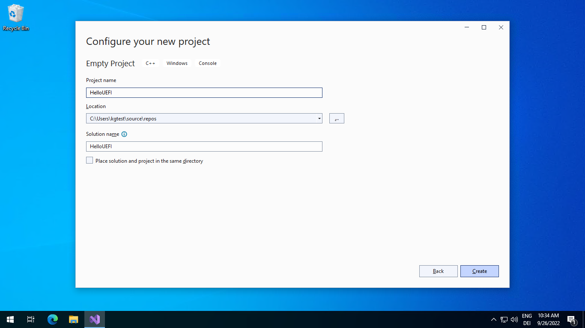

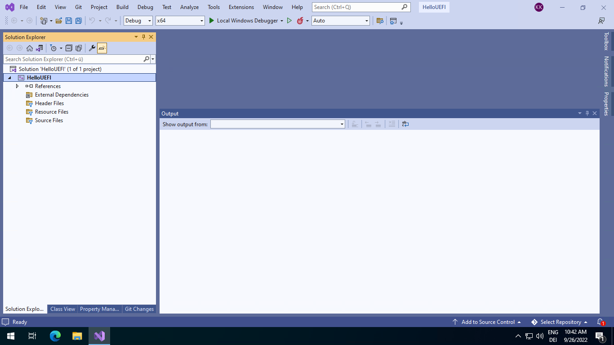

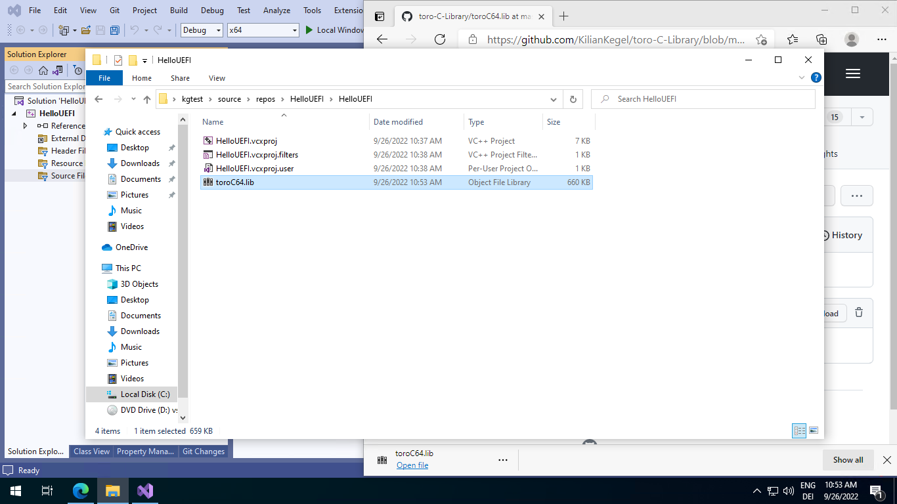
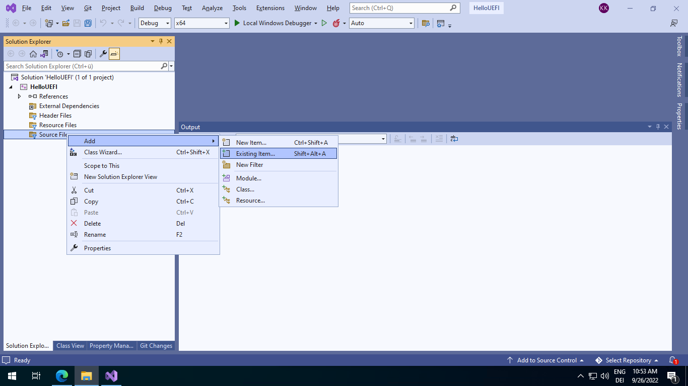

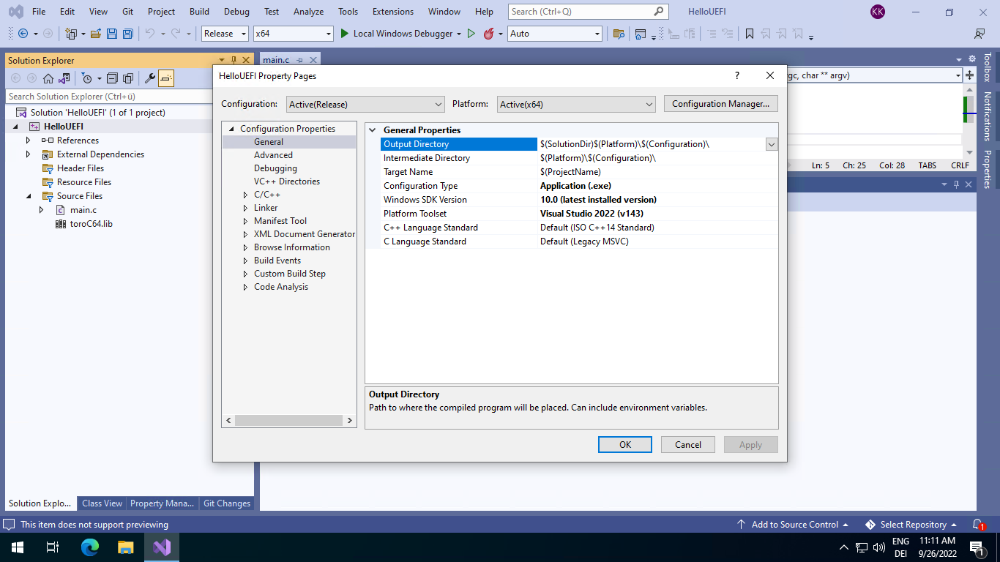

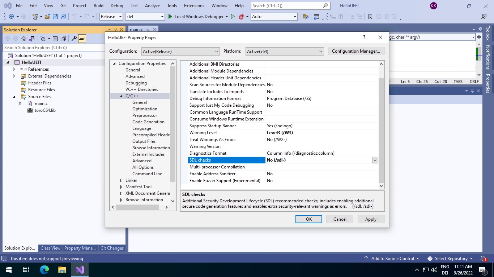

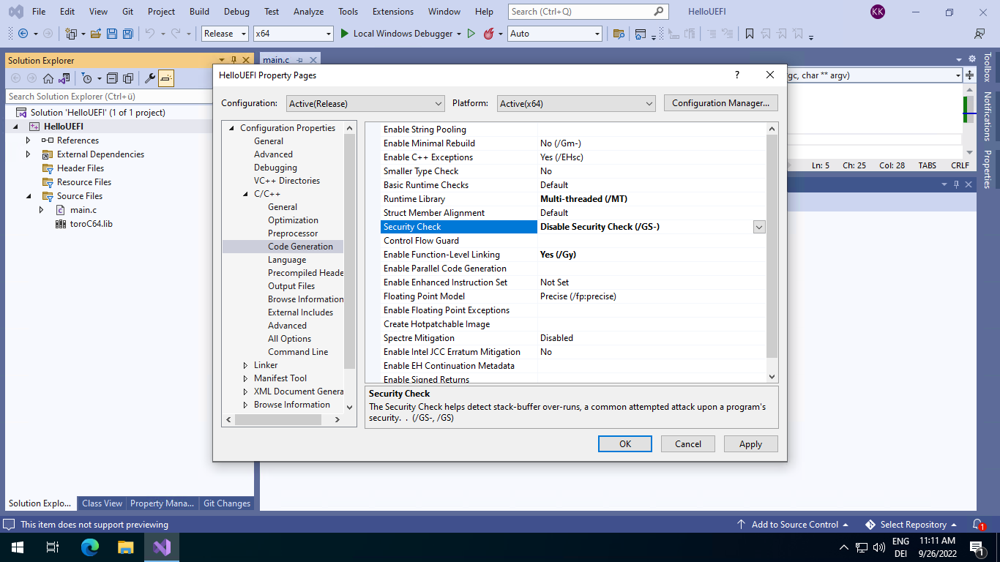
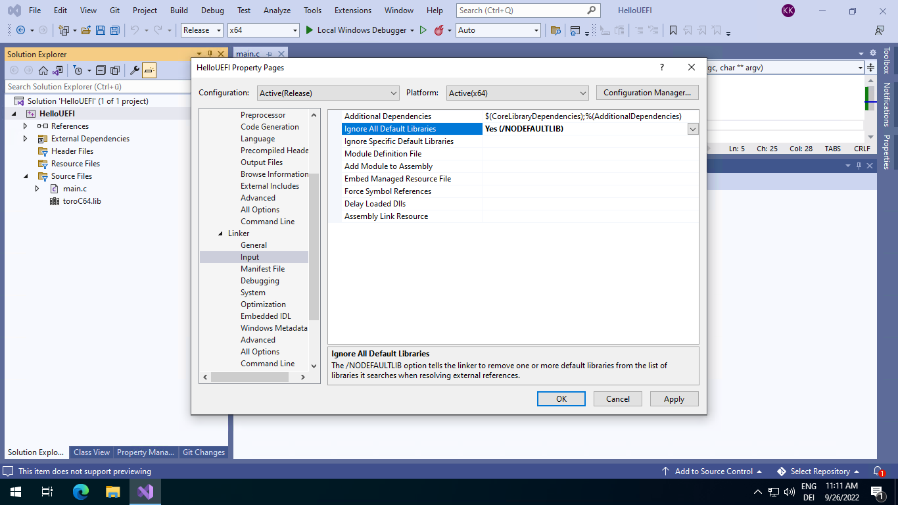

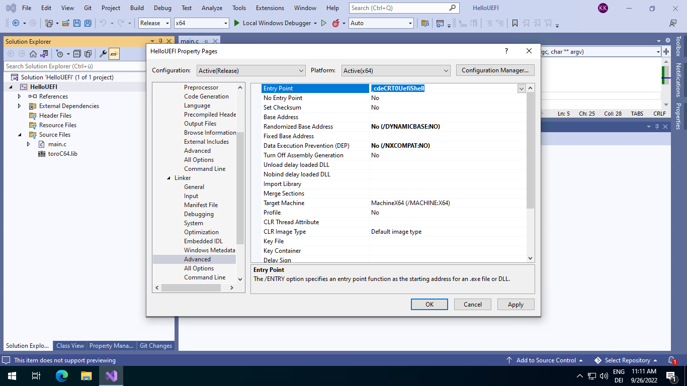
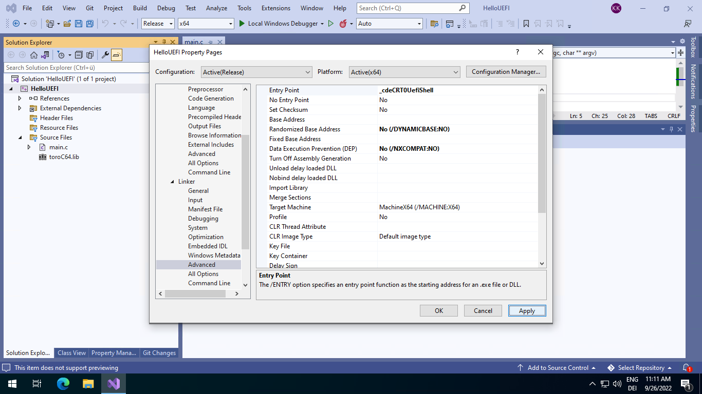

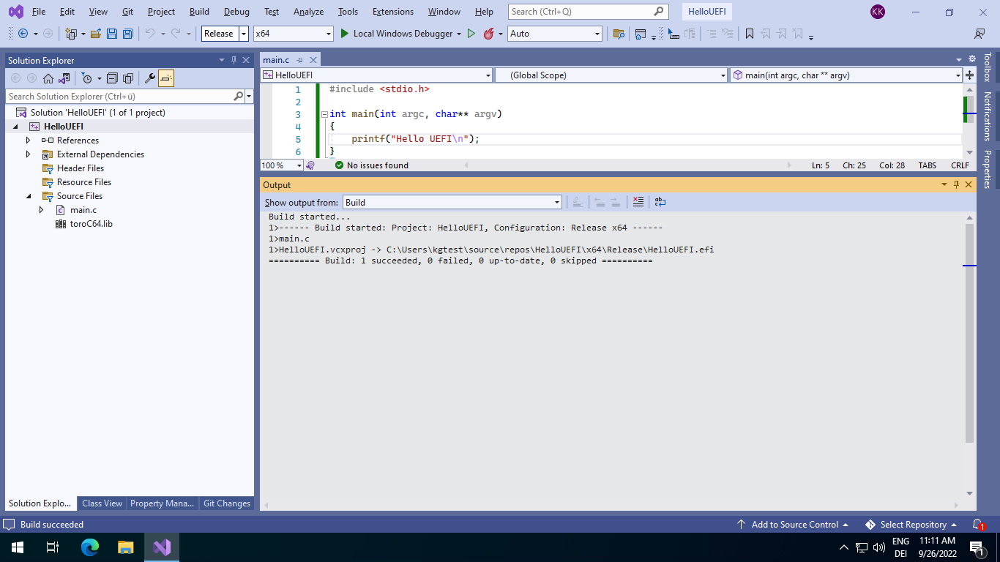
